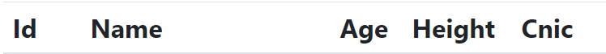

# JSON & AJAX AND ANGULAR PROJECT DOCUMENTATION
## JSON & AJAX CRUD
## Table of content
-    Definition
-    Create 
-    Update
-    Insert
-    Delete
### Defintion:
            JavaScript Object Notation is an open standard file format, and data interchange  format, that
            uses human-readable text to store and transmit data objects consisting of attribute–value pairs
            and array data types

### Create Operation:
                    First we create table and add some field like (id,name,age,cnic,height) 

## ANGULAR CRUD

