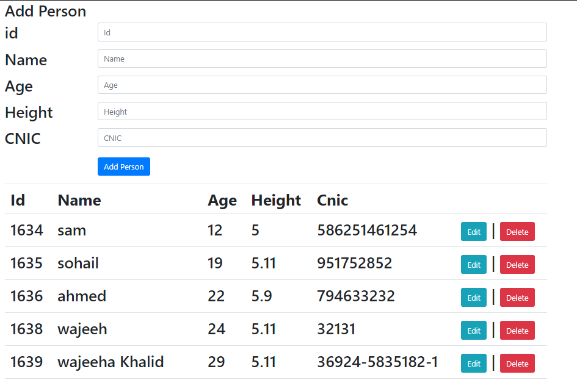
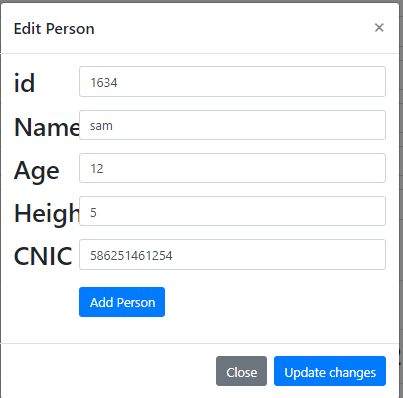
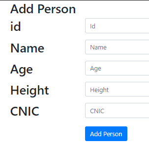

# JSON & AJAX AND ANGULAR PROJECT DOCUMENTATION
## JSON & AJAX CRUD
## Table of content
-    Definition
-    Create 
-    Update
-    Insert
-    Delete
### Defintion:
JavaScript Object Notation is an open standard file format, and data interchange  format, that
            uses human-readable text to store and transmit data objects consisting of attribute–value pairs
            and array data types

### Create Operation:
First we create the website front hand profile and its instruments like table, form, 
                    buttons and complete font hand. Here you can see my website fronthand and 
click this link to see its code [Create Code](create.txt)

### Update:
When you have to be done fronthand section then you appling CURD operation on the website properly.If you add data in 
your website and you want to update person's data you just open your web page and update as you want. You can see below the 
updating. Click this link and see its code [Update Code](updating.txt)

### Insertion:
If you want to add data on your website any person you just insert the data on the field. You just see the below how to 
add / insert the data. Click this link and see its code [Insert Code](insert.txt)

## ANGULAR CRUD

